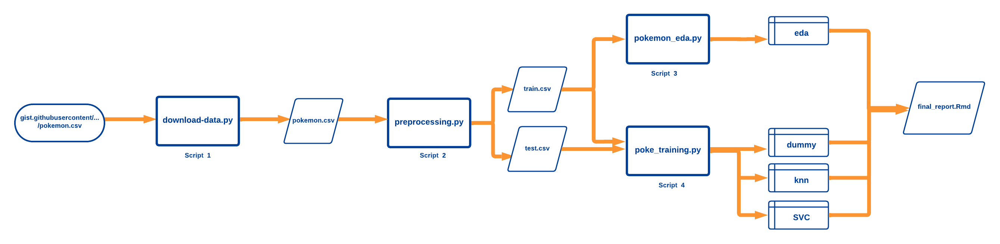

<!-- #region -->
# Pokemon Type Predictor

## Authors

### Gym Leaders (Original Team)

- Caroline Tang
- Sarah Abdelazim
- Vincent Ho
- Wilfred Hass

### Gym Trainers (Contributors)

Data analysis project created in part of requirements for DSCI 522 (Data Science Workflows); a course in the Master of Data Science program at the University of British Columbia.

## About

In this project, we attempt to classify a Pokemon's type (of which there are 18 possible types) based on the other stats (such as attack, defense, etc.) that it has. We chose $k$-Nearest Neighbours ($k$-NN) and Support Vector Classifier (SVC) algorithms for our models since they naturally support multi-class classifications, without having to use 'One-vs-One' or 'One-vs-Rest' methods. We use accuracy as the metric to score our models since there is no detriment to false positives or negatives, but we do want to know how many of the unknown Pokemon will be predicted correctly. On the unseen test data, the $k$ -NN model predicted 60% of the new Pokemon correctly while the SVC model predicted 67% correctly. Since these are not very accurate results, we recommend trying different estimators to fill up that Pokedex!

## Data

The data is found [here](https://gist.github.com/HansAnonymous/56d3c1f8136f7e0385cc781cf18d486c). The data was cleaned by [HansAnonymous](https://gist.github.com/HansAnonymous) and originally developed by [simsketch](https://gist.github.com/simsketch). The original data can be found in the [Pokemon database](https://pokemondb.net/pokedex). All rights belong to their respective owners.

Each row in the dataset contains a different Pokemon with various attributes. The attributes are measurements of the base Pokemon, such as `attack`, `speed` or `defense`.The different types of Pokemon are closely related to the other attributes it possesses. For example, a rock type Pokemon is likely to have higher defensive statistics (such as `defense` or `health points`) as well as rock-type abilities. It is also most likely to be coloured grey. A complete description of each feature in the raw dataset is listed below:

| Feature | Description |
| ------- | ----------- |
| `NUMBER`  | The National Pokedex Number of the Pokemon, unique to each Pokemon species |
| `CODE` | Identifier for the form of the pokemon, unique within each Pokemon species |
| `SERIAL` | Concatenation of `NUMBER` and `CODE`, unique to each row |
| `NAME` | Name of the Pokemon |
| `TYPE1` | Primary elemental type |
| `TYPE2`	| Secondary elemental type, if any |
| `COLOR`	| Main body color |
| `ABILITY1` | First passive ability option |
| `ABILITY2` | Second passive ability option, if any |
| `ABILITY HIDDEN` | Hidden (rare) passive ability, if any|
| `GENERATION` | Generation of games where pokemon was first introduced |
| `LEGENDARY` | Binary, indicates whether a Pokemon is legendary |
| `MEGA_EVOLUTION` | Binary, indicates whether a row is for the Mega Evolution of a Pokemon |
| `HEIGHT` | Height (m) |
| `WEIGHT` | Weight (kg) |
| `HP` | Base health point (HP) stat |
| `ATK` | Base physical attack stat |
| `DEF` | Base physical defense stat |
| `SP_ATK` | Base special attack stat |
| `SP_DEF` | Base special defense stat |
| `SPD` | Base speed stat |
| `TOTAL` | Sum of base stats |

## Pipeline




## Report

The final report is available [here](/doc/final_report.md)

## Usage

#### 1\. Without using Docker

To replicate the analysis, first clone this GitHub repository. Then, install `nb_conda_kernels` in your **base** environment. Now, install the dependencies listed in the `env-poke-type-pred.yaml` file below as an Anaconda environment, using:

```console
conda install -c conda-forge nb_conda_kernels
conda env create -f env-poke-type-pred.yaml
```

You can switch to this environment using:

```console
conda activate poketype
```
You will also need to install the R version and R packages listed [here](#dependencies).

Then run this command:

```console
make all
```

To reset the repo to a clean state, with no intermediate or results
files, run the following command at the command line/terminal from the
root directory of this project:

```console
make clean
```

#### 2\. Using Docker

To replicate the analysis using Docker, first clone this GitHub repository. You will also need Docker installed on your computer and have it turned on. You can follow the instructions [here](https://docs.docker.com/get-docker/) if you need to install Docker. After installation, you can run the following command to build the Docker image in the parent directory of the repository folder in your computer.

```console
docker build --tag pokeball .
```

You can then reproduce the analysis using:

```console
docker run -it --rm -v /$(pwd):/home/jovyan pokeball make -C /home/jovyan/ 
```

To reset the repo to a clean state, with no intermediate or results
files, run the following command at the command line/terminal from the
root directory of this project:

```console
docker run -it --rm -v /$(pwd):/home/jovyan pokeball make -C /home/jovyan/ clean
```

## Dependencies

- Conda Packages:
    - ipykernel
    - matplotlib
    - scikit-learn>=1.1.3
    - requests>=2.24.0
    - graphviz
    - python-graphviz
    - altair
    - altair_saver
    - selenium<4.2.0
    - pandas<1.5
    - imbalanced-learn
- Pip Packages:
    - joblib==1.1.0
    - psutil>=5.7.2
    - docopt-ng
    - vl-convert-python
- R Packages:
    - knitr
    - rmarkdown

## License

The Pokemon Type Predictor materials here are licensed under the Creative Commons Attribution 2.5 Canada License (CC BY 2.5 CA).

## Attributions

We attribute the creation of the `license` file to Tiffany Timbers, with more information available in the `license` file.

The data is attributed to the GitHub users: [HansAnonymous](https://gist.github.com/HansAnonymous/56d3c1f8136f7e0385cc781cf18d486c), [simsketch](https://gist.github.com/simsketch) and the online [Pokemon database](https://pokemondb.net/pokedex).
<!-- #endregion -->
