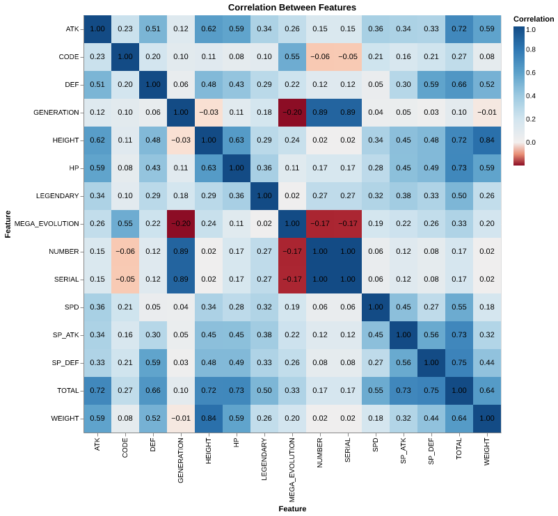

```{r setup, include=FALSE}
knitr::opts_chunk$set(echo = FALSE)
```

# Introduction
Originally developed as a video game, the hit 90's pop culture franchise Pokemon flourished into multiple media streams. 
As was big in the 90's, Pokemon took over the trading card industry and even turned into a television show that rocked the world.

Pokemon (the creatures) share the same name as the title of the franchise. 
These creatures come in a variety of shapes, sizes, and colours and are used by their trainers in battles. 
Each Pokemon has specific attributes like type, attack, defense, and speed, which confer different strengths and weaknesses. 
A combination of these attributes (and a little luck) are what determines if a Pokemon will either win or lose.

In the show, the famous question "Who's that Pokemon?!" was often asked at the beginning of a commercial break, with an image of the shaded outline of a Pokemon. 
The show would reveal the Pokemon at the end of the commercial break, rewarding those who stayed through the advertisements.

Inspired by this ploy of the franchise, we thought it might be interesting to predict an attribute of a given Pokemon. 
This thought was further developed when we remembered that as each generation of the franchise is released, the players encounter brand new Pokemon that the world has never seen. 
When encountering a new Pokemon, the game gives no indication of its type, leading us to our question: given the attributes of an undiscovered Pokemon, are we able to predict its type? 
Although this question has been explored before using solely the images of Pokemon [@shahir_2022] or their battle stats [@residentmario_2016], 
we are attempting to do this using both physical characteristics such as color, height, and weight, as well as their battle capabilities (abilities and stats).

# Data
The dataset [@hansanonymous] we are using has both numeric features (like `attack` or `defense`) and text features (like their `abilities` or `colour`) of the Pokemon. The data was cleaned by [HansAnonymous](https://gist.github.com/HansAnonymous) and originally developed by [simsketch](https://gist.github.com/simsketch). The original data can be found in the [Pokemon database](https://pokemondb.net/pokedex). All rights belong to their respective owners.

Each row in the dataset contains a different Pokemon and its attributes, including type, color, attack and defense. The different types of Pokemon are closely related to the other attributes it possesses. For example, a rock type Pokemon is likely to have higher defensive stats (such as `defense` or `health points`) as well as rock-type abilities. It is also most likely to be coloured grey. To complicate this even further, there are some Pokemon with more than one type, such as Pidgey, who has both `Normal` and `Flying` types. 

# EDA

Most of the numerical attributes appear to be relatively normally distributed except for `height` and `weight`, which are right skewed. Only a small amount of pokemon can evolve, be legendary or have a mega evolution form so it makes sense that `code`, `legendary` and `mega_evolution` are so imbalanced.

```{r eda1, fig.cap="Figure 1. Distributions of numeric characteristics", out.width='90%'}

```

In the correlation table (Figure 2), we can see that the numeric attributes have a high correlation with each other, which makes sense because if the pokemon is stronger, its overall score should be higher. However, their numerical attributes are not highly correlated with some identification variables such as `number`, `code`, `serial` and `generation`.

```{r eda2, fig.cap='Figure 2. Correlation table between all features in the dataset', out.width='90%'}

```


# Pre-processing

In the EDA, we found that some columns, such as `ability2` and `type2`, contain missing values. 
These columns are only filled if the Pokemon have a second ability or type. 
Using the `Python` [@python] package `pandas` [@pandas], we imputed the missing values in these 
columns using the same ability or type from their respective counterparts (`type1` or `ability1`). 
We then split the data into a training and test set in a 70-30 split in preparation for fitting 
and scoring our models.

We dropped the columns that were generally unique or represented an index 
(such as `name`, `serial` and `generation`). The `total` column was also dropped as it is the sum 
of the other base stats. We used standard scaling on all of the base stats of the Pokemon 
(i.e. the numeric features) and one-hot encoded text features, since they are categorical and 
non-ordinal. We kept binary features (`legendary` and `mega_evolution`) as they were. 
We used the `handle_unknown=’ignore’` argument to `OneHotEncoder` since the new Pokemon in the 
test set could have abilities that Pokemon in the training set don’t have. 

# Analysis

We attempted to use two different models to classify Pokemon by type: 
a Support Vector Classifier (SVC), and $k$ - Nearest Neighbours ($k$ -NN). 
We use these models since theoretically, a Pokemon of similar stats, colour etc. 
will have the same type as other Pokemon with those same similar stats. These two models 
are examples of analogy based algorithms, and innately support multi-class classification
without using 'one-vs-one' or 'one-vs-rest' methods, so we believe they will perform well 
given the task at hand. We also compared these two models to a baseline model, the dummy classifier. 
All of these models were implemented in `sklearn` [@sklearn].

The models each have their own set of hyperparameters that will have to be optimized 
using cross-validation. We will use average accuracy as the metric to determine each of 
these hyperparameters and show plots of the accuracy and hyperparameters to determine 
the best ones. 

# Results

## Baseline

In a confusion matrix, the perfect prediction has every value in a box along the diagonal, with predicted labels on the x-axis and truth labels on the y-axis. The entries that are not along the diagonal line tells us about what is being predicted incorrectly. As speculated, the dummy classifier predicts each type as the most common class, water. Fig. 3 shows the confusion matrix of the dummy classifier on the unseen Pokemon test set. The dummy classifier has an accuracy of 14.2% with a cross-validation and training score of 12.4%.

```{r dummy, fig.cap='Figure 3. Confusion matrix visualizing the dummy classifier predictions vs the true labels.', out.width='90%'}

```

## k-NN

In our $k$ -NN model, Fig. 4 shows that each value along the diagonal line has the highest number in their respective row or column, meaning our model correctly predicts every type of Pokemon, most of the time. Our model performs pretty well at predicting some types of Pokemon such as Grass and Water type. For the Grass type, it correctly predicted 19 out of 26 possible Grass types and for Water type, it correctly predicted 33 out of 45 water types. Overall, the $k$ -NN had a test accuracy of 60.3% with a cross-validation score of 56.9% and training score of 100%. 

```{r knn, fig.cap='Figure 4. Confusion matrix visualizing predictions from the best k-NN model vs the true labels.', out.width='90%'}

```

## SVC

In our SVC model, Fig. 5 shows some marginal improvements in the prediction for each class. One of the largest improvements was the prediction of Ice types, increasing from 5 correctly predicted Pokemon to 10 now. Overall, the SVC has a test accuracy of 69.2% with a cross-validation score of 68.6% and training score of 100%. 

```{r svc, fig.cap='Figure 5. Confusion matrix visualizing predictions from the best SVC model vs the true labels.', out.width='90%'}

```

# Discussion

Overall, our chosen models were somewhat accurate in classifying the pokemon into their different types; both the k-NN (60.3%) and the SVC (69.2%) showed much higher accuracies than the baseline model (14.2%). Both the SVC and k-NN models showed low standard deviations in the cross-validation, 0.028 and 0.026 respectively. This shows confidence in our model accuracies. 

However, there are some limitations to our models. We note that both models are significantly overfitting, since they both have 100% training accuracies. The best $k$-NN model was with 1 neighbour, which is also indicative of overfitting. The second-best $k$-NN model was with $k=8$, or 8 neighbours, but the accuracy dropped to about 49%. In terms of our data, we initially assumed that all rows were independent of each other, but our data contained different forms of the same pokemon (often with very similar, if not the exact same stats), and most of the time they definitely had the same type.

To improve these models in future, we could investigate some of the most misclassified observations and compare them to those which were classified correctly. We could see which features possibly led to misclassification and explore if any feature engineering could improve the model. We could also redo this analysis with duplicated forms removed, or with only non-evolved Pokemon as some Pokemon can evolve to stronger forms while keeping similar types and structure of abilities, which may also serve as “duplicate values”.

# References